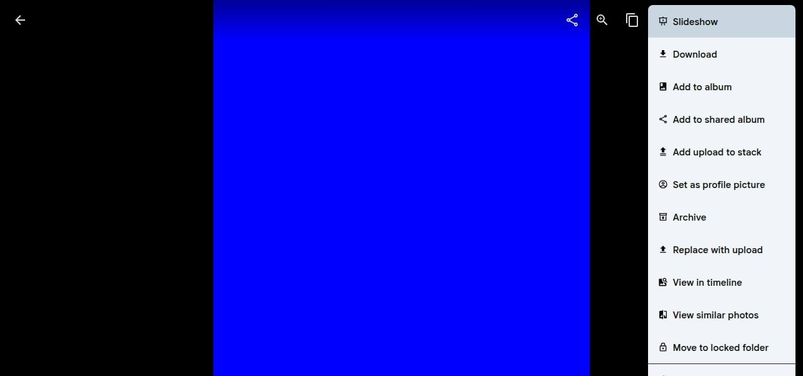

挑好 issue 之後，下一步是重現 bug。不重現就不要動手修，因為你不確定自己理解的跟實際問題是不是同一件事。

## 把 Immich 跑起來

Immich 有提供 docker compose，照著 docs 跑就好。但有個坑: 官方的 dev compose 會在 container 裡跑 `pnpm install`，machine learning 那個 image build 起來非常吃記憶體。我的機器只有 8GB RAM，直接被 OOM kill。

解法: 不用 dev compose，改用 production 的 pre-built image。反正這階段只是要重現 bug，不需要改 code。

```bash
docker compose up -d
```

四個 container 跑起來: postgres、redis、server、machine-learning。打開 `localhost:2283` 就能看到 Immich 的 web UI。

## 重現步驟

1. 建立帳號，隨便上傳幾張照片
2. 點進任一張照片的詳細頁
3. 點右上角的三點選單 (⋯)
4. 選單打開，往下看

結果: 選單底部超出畫面，最後幾個項目被切掉看不到。



14 個選單項目，最後 3-4 個被切掉: Move to locked folder 只看到一半，後面的完全看不到。

我的環境數據:
- Menu top: 8px
- Menu bottom: 608px
- Viewport height: 600px
- 溢出: 8px

## 定位問題

打開 DevTools 看 DOM 結構，問題出在 `context-menu.svelte`:

- 選單的 `ul` 用了 `max-h-dvh`，等於 100% viewport height
- 但選單的 top position 不是 0，比如 top=8px
- 所以實際可用空間是 viewport - 8px = 592px，但 max-height 給了 600px
- 多出來的 8px 就溢出畫面了

簡單說: max-height 沒有把選單自身的位置算進去。

## 修復方向

把 `max-h-dvh` 改成動態計算:

```css
max-height: calc(100dvh - {top}px - 8px)
```

這樣不管選單從哪個位置打開，底部都不會超出 viewport。加上 `overflow-auto` 就能 scroll。

改動範圍: 只動 `context-menu.svelte` 一個檔案，大概 2-3 行。

## 重點整理

- 修 bug 之前一定要先重現，確認自己理解的問題跟實際一致
- 開發環境跑不起來的話，production image 也能拿來重現 bug
- DevTools 是定位前端 bug 的主要工具，看 computed style 很快就能找到問題
