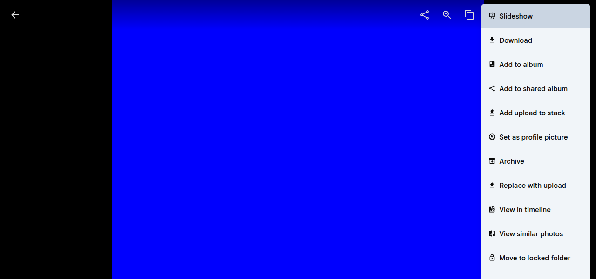

Bug 重現了，接下來是修它。

## 定位問題

打開 DevTools 看 context-menu.svelte 的結構。選單是一個 `ul`，外面包一個 `fixed` 的 `div`。關鍵在 `ul` 的 class:

```svelte
class="{isVisible ? 'max-h-dvh' : 'max-h-0'} ..."
```

`max-h-dvh` 等於 `max-height: 100dvh`，也就是整個 viewport 的高度。

但選單不是從 y=0 開始的。它的 top position 是動態計算的:

```js
const top = Math.max(8, Math.min(window.innerHeight - menuHeight, y));
```

假設 viewport 高 600px，選單從 top=8px 開始，那實際可用空間是 592px。但 `max-h-dvh` 給了 600px，多出來的 8px 就溢出畫面了。

## 修法

邏輯很簡單: max-height 要扣掉 top position。

原本 position 的 derived 計算已經有 left 跟 top，加一個 maxHeight 就好:

```js
const maxHeight = window.innerHeight - top - 8;
return { left, top, maxHeight };
```

8px 是底部留的 margin，跟 top 的 `Math.max(8, ...)` 對稱。

然後 template 把 Tailwind class 換成 inline style:

```svelte
// 移除
class="{isVisible ? 'max-h-dvh' : 'max-h-0'} ..."

// 改成
style:max-height={isVisible ? `${position.maxHeight}px` : '0px'}
```

改動就這樣，一個檔案，三處變更。

## 為什麼用 inline style 不用 Tailwind

`max-h-dvh` 是靜態值，但我們需要的是根據 top position 動態計算的值。Tailwind 沒有辦法表達動態值，所以改用 Svelte 的 `style:` directive。這在 Immich codebase 裡不算少見，同一個檔案的 `style:left` 和 `style:top` 也是這樣做的。

## 驗證

修復前，選單底部超出畫面，最後幾個項目被切掉:



修復後，選單限制在 viewport 內，超出的項目可以 scroll:


## 提 PR

Fork repo，建 branch `fix/context-menu-overflow`，commit message 用 Immich 的 conventional commit 格式:

```
fix(web): prevent context menu from overflowing viewport
```

PR 描述要寫清楚三件事: 問題是什麼、改了什麼、修復前後的差異。附上 issue number 讓 GitHub 自動 link。

PR: [#26041](https://github.com/immich-app/immich/pull/26041)

## 重點整理

- 讀 source code 比猜測有效，打開檔案看幾分鐘就能定位問題
- 動態值用 inline style，靜態值用 Tailwind，不要硬混
- commit message 跟 PR 描述要符合專案的慣例，看幾個已合併的 PR 就知道格式
- 改動越小越好，reviewer 看三行比看三十行開心
